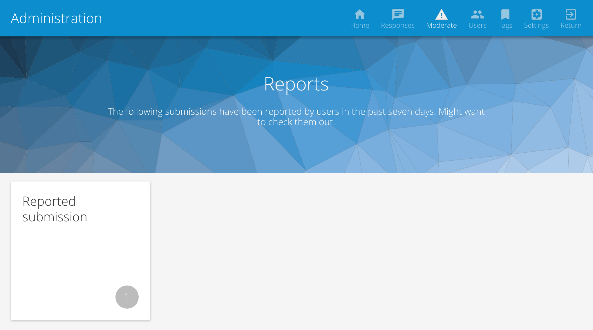
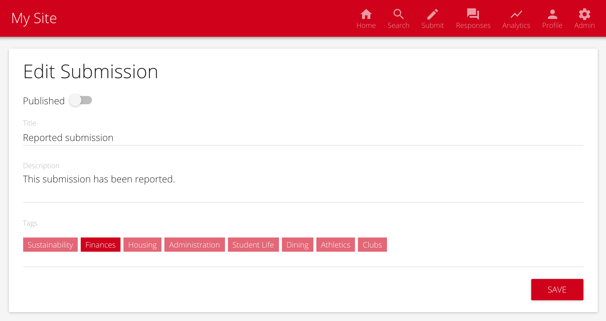

# Moderation

Moderation tools allow [adminstrators](user_management.md) to easily control which [submissions](submissions.md) are publicly visible on the site.

> You will need the [administrative role](user_management.md) to view reported submissions and hide submissions.

## Viewing Reported Submissions

 * From the site homepage, select **Admin** from the upper right navigation. You are now in the administrative portal.
 * From the administrative portal, select **Moderate**.
 * A list of reported submissions is shown.

# Hiding Submissions

By default, all submissions are publicly visible on CollegePulse. To make a petition private (so only administrators can view it):

 * Navigate to the submission's page.
 * Select the **Edit Submission** in the right panel.
 * Toggle **Published** to the off position.
 * Click **Save**.

