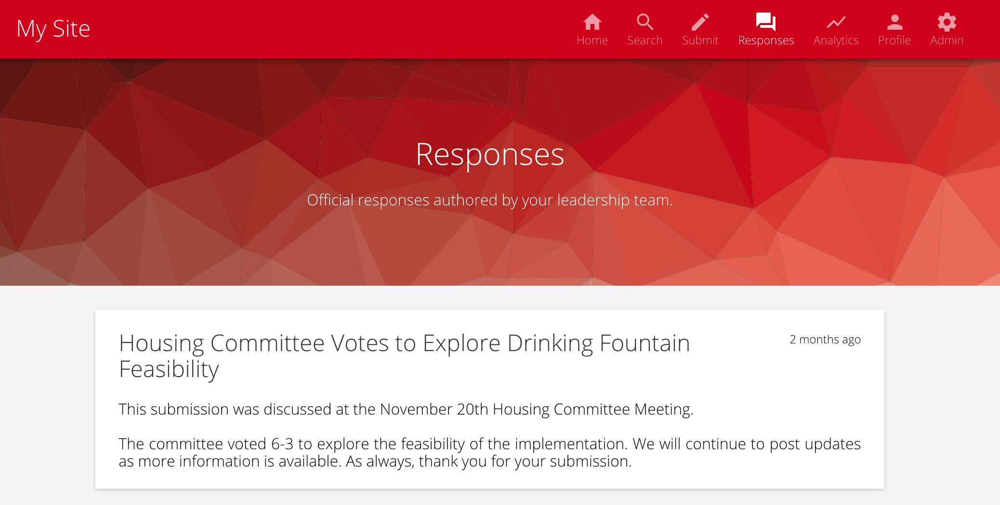
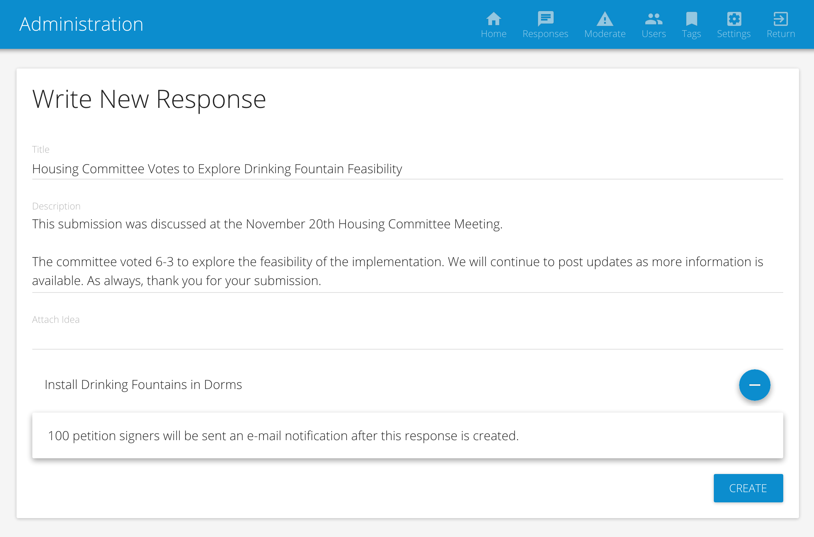

# Responses

Responses are official replies to [submissions](submissions.md).

## Viewing Responses

 * From the site homepage, select **Responses** from the upper right navigation.

## Creating Responses

> Responses can only be created by [administrators](user_management.md).

 * From the site homepage, select **Admin** from the upper right navigation. You are now in the administrative portal.
 * From the administrative portal, select **Responses**.
 * Click the **Write New Response** button to author a response.

> If you recieve multiple related submissions concerning an issue with a single resolution, write a single response and attach each submission to it.

 * As submissions are attached to the responses, an approximate number of users that will recieve notifications is shown.

