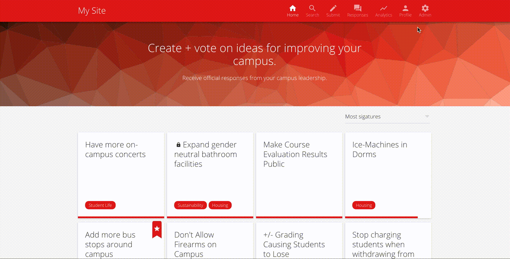

# Site Settings

Through the site settings page, the site color, site name, and timezone can be figured.

> You will need administrative access in order to customize these settings.

To customize site settings:

 * From the homepage, select the 'Admin' gear symbol in the upper right navigation
 * Select 'Settings' from the upper right navigation 
 * Modify your settings as necessary.

