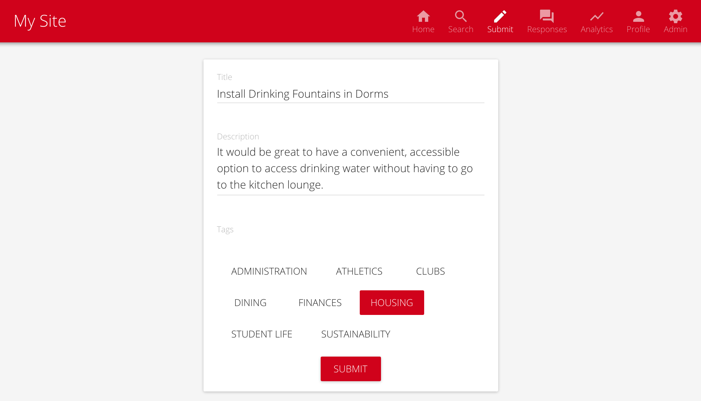
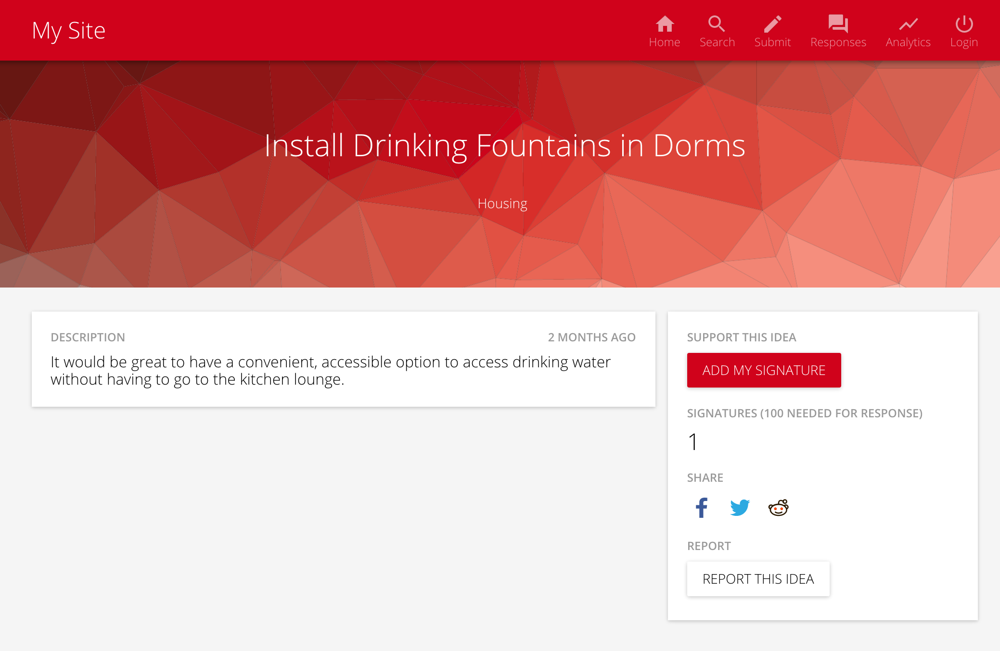
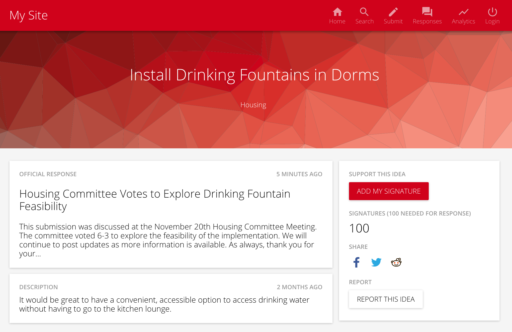

# Submissions

Submissions are the mechanism for community members to create and share ideas to improve your campus.

## Creating Submissions

From the homepage, select the **Create** button from the upper right site navigation. Then type in a title, description, and add any tags to your submission.

After creating the submission, you are brought to the submission page.

## Adding Signatures

Click the **Add My Signature** button to sign an idea. You can only sign once, and signatures cannot be revoked.

## Viewing Responses

After an administrator writes a response, it will appear above the submission description.

