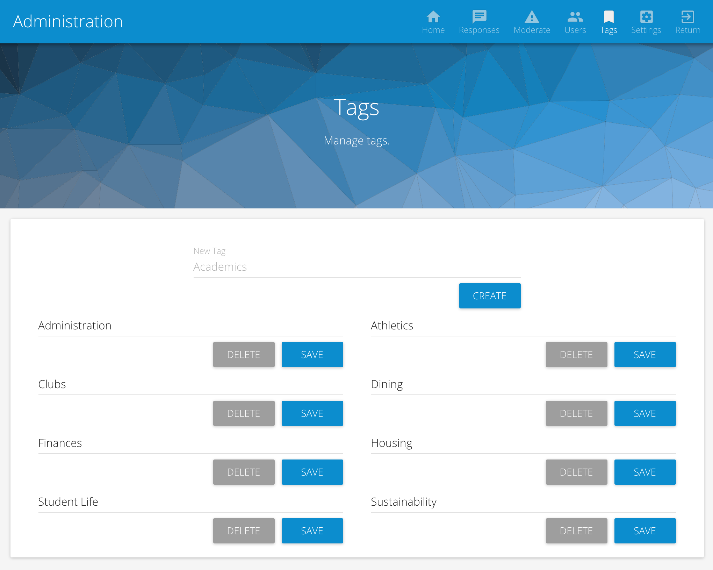

# Tags

Tags are general topics that are more broadly related to a [submissions](submissions.md). In the context of a collegiate community, example tags may include athletics, housing, dining, governance, academics, etc.

## Managing Tags

> You will need the administrative role to manage tags.

 * From the homepage, select the **Admin** option from the upper right navigation. You are now in the administrative portal.
 * In the administrative portal, select **Tags** from the navigation.
 * Type a new tag (maximum 15 characters) name and click **Create**. 

