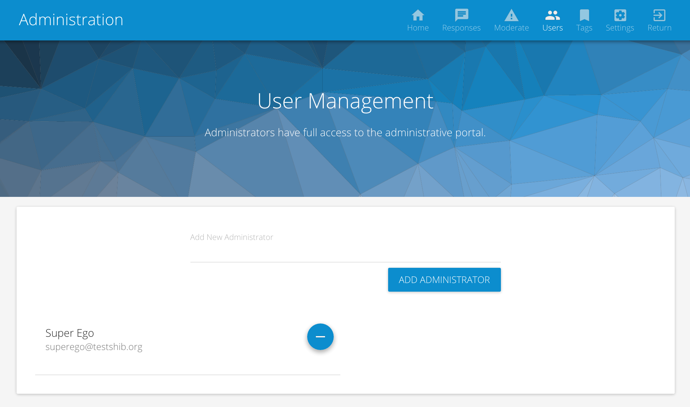

# User Management

CollegePulse offers two user roles: **administrators** and **non-administrators**.

Non-administrators can:

 * Create and sign [submissions](submissions.md)

Administrators can perform non-administrative functionality, plus:

 * Promote users to the administrative role
 * Edit submissions
 * Create and edit responses
 * Create and edit tags
 * Manage [site settings](site_settings.md)

# Managing Administrative Users

> You will need administrative access to manage administators.

To promote a user to administrator:

 * From the homepage, select the **Admin** gear icon in the upper right navigation. This will bring you to the administrative portal.
 * From the administrative portal navigation, select **Users**.
 * Search for the user by e-mail (preferred), first name or last name. A user will need to login to CollegePulse before they can be promoted to the Administrator role.

To depromote a user to non-administrative role:

 * Select the `-` sign next to the administrator's name.
